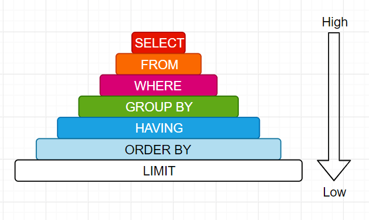
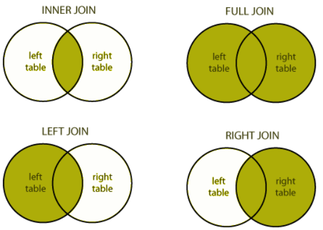

# Базовые знания по разработке

## Принципы качественной разработки
Источник: https://habr.com/ru/companies/itelma/articles/546372/


1. **YAGNI** (You Aren’t Gonna Need It / Вам это не понадобится)  
Если пишете код, то будьте уверены, что он вам понадобится. Не пишите код, если думаете, что он пригодится позже. 
Если код снова понадобятся – вы сможете воспользоваться git-репозиторием, чтобы воскресить его из мертвых.
---

2. **DRY** (Don’t Repeat Yourself / Не повторяйтесь)  
Идея вращается вокруг единого источника правды (single source of truth — SSOT).  
SSOT – это практика структурирования информационных моделей и схемы данных, 
которая подразумевает, что все фрагменты данных обрабатываются (или редактируются) только в одном месте.  
В большинстве случаев дублирование кода происходит из-за незнания системы.  
Прежде чем что-либо писать, проявите прагматизм: осмотритесь. Возможно, эта функция где-то реализована. 
Возможно, эта бизнес-логика существует в другом месте.  
Повторное использование кода – всегда разумное решение.
---

3. **KISS** (Keep It Simple, Stupid / Будь проще)  
Принцип гласит, что простые системы будут работать лучше и надежнее.  
Применительно к разработке ПО он значит следующее – не придумывайте к задаче более сложного решения, 
чем ей требуется.  
Иногда самое разумное решение оказывается и самым простым.   
Написание производительного, эффективного и простого кода – это прекрасно.
---

4. **Big Design Up Front** (Глобальное проектирование прежде всего)  
Прежде чем переходить к реализации, убедитесь, что все хорошо продумано.
Зачастую продумывание решений избавляло нас от проблем при разработке…  
Внесение изменений в спецификации занимало час или два. Если бы мы вносили эти изменения в код,  
на это уходили бы недели.  
Составив план, вы избавите себя от необходимости раз за разом начинать с нуля.
---

5. **SOLID**
- `Single-responsibility principle /Принцип единственной ответственности`  
Каждый объект, класс и метод должны отвечать только за что-то одно.  
Если ваш объект/класс/метод делает слишком много, вы получите спагетти-код.  
Еще один побочный эффект такого кода – проблемы с тестированием.  
Запутанный функционал тестировать сложно.

- `Open–closed principle / Принцип открытости-закрытости`  
Программные объекты должны быть открыты для расширения, но закрыты для модификации.  
Речь о том, что `НЕЛЬЗЯ` переопределять методы или классы, просто добавляя дополнительные функции  
по мере необходимости.  
Хороший способ решения этой проблемы – использование наследования.

- `Liskov substitution principle / Принцип подстановки Лисков`  
Этот принцип гласит, что объекты старших классов должны быть заменимы объектами подклассов,  
и приложение при такой замене должно работать так, как ожидается.
Наследующий класс должен дополнять, а не замещать поведение базового класса.

- `Interface segregation principle / Принцип разделения интерфейсов`  
Объекты не должны зависеть от интерфейсов, которые они не используют.
ПО должно разделяться на независимые части. Побочные эффекты необходимо сводить к минимуму,  
чтобы обеспечивать независимость.  
Убедитесь, что вы не заставляете объекты реализовывать методы, которые им никогда не понадобятся.

- `Dependency inversion principle / Принцип инверсии зависимостей`  
Этот принцип невозможно переоценить. Мы должны полагаться на абстракции, а не на конкретные реализации.  
Компоненты ПО должны иметь низкую связность и высокую согласованность.  
Заботиться нужно не о том, как что-то устроено, а о том, как оно работает.  
Простой пример – использование дат в JavaScript. Вы можете написать для них свой слой абстракции.  
Тогда если у вас сменится источник получения дат, вам нужно будет внести изменения в одном месте, а не в тысяче.
`Формулировка`:  
-- Модули верхних уровней не должны зависеть от модулей нижних уровней. Оба типа модулей должны зависеть от абстракций.  
-- Абстракции не должны зависеть от деталей. Детали должны зависеть от абстракций.  
Объяснение: https://www.youtube.com/watch?v=ZS1klrs6g-4
---

6. **Avoid Premature Optimization** (Избегайте преждевременной оптимизации)  
Поймите правильно, предвидеть, что произойдет что-то плохое – это хорошо.  
Но прежде чем вы погрузитесь в детали реализации, убедитесь, что эти оптимизации действительно полезны.  
Очень простой пример – масштабирование. Вы не станете покупать 40 серверов из предположения,  
что ваше новое приложение станет очень популярным. Вы будете добавлять серверы по мере необходимости.
Преждевременная оптимизация может привести к задержкам в коде и, следовательно,  
увеличит затраты времени на вывод функций на рынок.  
Многие считают преждевременную оптимизацию корнем всех зол.
---

7. **Бритва Оккама** (ле́звие О́ккама)  
«Не следует множить сущее без необходимости» (либо «Не следует привлекать новые сущности  
без крайней на то необходимости».  
Не создавайте ненужных сущностей без необходимости. Будьте прагматичны — подумайте, нужны ли они,  
поскольку они могут в конечном итоге усложнить вашу кодовую базу.


## Запахи кода
Источник: https://www.youtube.com/watch?v=1KhhJ5f_BbU

- `Rigidity` (Ригидность / Жесткость)  
Цена внесения одного изменения ОЧЕНЬ высока.  
Если на реализацию чего-нибудь простого уходит много часов - ПО ригидно.  
`Источник проблемы` - высокая связанность между модулями.
---
- `Fragility` (Хрупкость)  
Небольшие изменения в одном модуле вызывают появление ошибок в других модулях.  
Опасно то, что ошибки могут возникать в слабосвязанных модулях.  
`Источник проблемы` - плохо спроектированная связь между модулями.
---
- `Immobility` (Неподвижность)
Компоненты (модули) ПО нельзя использовать в других системах.  
Хорошая практика, когда мы можем извлечь компонент и без особых усилий адаптировать его для использования в другой системе.  
`Источник проблемы` - высокая связанность между модулями.
---
- `Viscosity` (Вязкость)  
Добавление одной функции приводит к необходимости взаимодействия со множеством аспектов,
например с безопасностью на транспортном уровне. Трудности при слияниях веток во время разработки, т.к.
это изменение влияет на другие компоненты программы.  
`Источник проблемы` - высокая связанность между модулями.
---
- `Needless complexity` (Излишняя сложность)  
При попытках постоянно спрогнозировать будущие изменения разработчик вводит ИЗЛИШНИЕ точки расширения,  
например введение лишних интерфейсов, слишком сложных иерархий классов, чтобы ВСЁ предвидеть, что  
в априори НЕ возможно.  
Необходимо концентрироваться на ТЕКУЩИХ требования и создание точки расширения оправдано только в случай 99% уверенности, что это понадобится.

  
## Абстрактные классы/методы
Источник: https://sky.pro/media/raznicza-mezhdu-abstraktnym-klassom-i-interfejsom-v-python/  
`Абстрактный класс` — это класс, который не может быть инстанциирован, то есть нельзя создать его экземпляр.  
Он представляет собой шаблон или чертеж для создания других классов.  
Абстрактный класс может содержать абстрактные методы (методы без реализации) и/или обычные методы.  
_Пример абстрактного класса:_  
```
from abc import ABC, abstractmethod
 
class AbstractClassExample(ABC):
 
    @abstractmethod
    def do_something(self):
        pass
```
В этом примере AbstractClassExample — это абстрактный класс, который содержит абстрактный метод do_something.   
Этот метод должен быть обязательно реализован в любом классе, который наследует AbstractClassExample

`Интерфейс`. В Python нет встроенной поддержки интерфейсов, как это есть, например, в Java.  
Однако концепцию интерфейса можно реализовать с помощью абстрактного класса,  
в котором все методы являются абстрактными.  
_Пример интерфейса:_  
```
from abc import ABC, abstractmethod
 
class InterfaceExample(ABC):
 
    @abstractmethod
    def method1(self):
        pass
 
    @abstractmethod
    def method2(self):
        pass
```
В этом примере `InterfaceExample` — это интерфейс, который содержит два абстрактных метода: `method1` и `method2`.  
Любой класс, который наследует `InterfaceExample`, должен реализовать оба этих метода.  
Важно понимать, что принципиальное отличие между абстрактным классом и интерфейсом заключается в том,  
что абстрактный класс может иметь как абстрактные, так и неабстрактные методы,  
тогда как интерфейс содержит только абстрактные методы.  
Следовательно, абстрактный класс можно использовать для создания общей функциональности для группы связанных классов,  
а интерфейс — для определения общего поведения группы классов, возможно, не связанных между собой.

## Алгоритмическая сложность
Источник: https://proglib.io/p/slozhnost-algoritmov-i-operaciy-na-primere-python-2020-11-03  

### Списки (lists)
| Операция                       | Пример                    | Сложность   | Примечания                                           |
|:-------------------------------|:--------------------------|:------------|:-----------------------------------------------------|
| Получение элемента             | l[i]                      | O(1)        |                                                      |
| Сохранение элемента            | l[i] = 0                  | O(1)        |                                                      |
| Размер списка                  | len(l)                    | O(1)        |                                                      |
| Добавление элемента в конец    | l.append(5)               | O(1)        |                                                      |
| Удаление последнего элемента   | l.pop()                   | O(1)        | То же, что и l.pop(-1)                               |
| Очищение списка                | l.clear()                 | O(1)        | То же, что и l = []                                  |
| Получение среза                | l[a:b]                    | O(b-a)      | l[1:5] => O(1), l[:] => O(len(l) – 0) = O(N)         |
| Расширение                     | l.extend(...)             | O(len(...)) | Зависит от размера расширения                        |
| Создание                       | list(...)                 | O(len(...)) | Зависит от размера итерируемой структуры             |
| Сравнение списков (==, !=)     | l1 == l2                  | O(N)        |                                                      |
| Вставка                        | l[a:b] = ...              | O(N)        |                                                      |
| Удаление элемента (del)        | del l[i]                  | O(N)        | Зависит от i. O(N) – в худшем случае                 |
| Проверка наличия               | x in/not in l             | O(N)        | Линейный поиск в списке                              |
| Копирование                    | l.copy()                  | O(N)        | То же, что и l[:]                                    |
| Удаление значения (remove)     | l.remove(...)             | O(N)        |                                                      |
| Удаление элемента (pop)        | l.pop(i)                  | O(N)        | O(N-i). Для l.pop(0) => O(N)                         |
| Получение мин/макс значения    | min(l)/max(l)             | O(N)        | Линейный поиск в списке                              |
| Разворачивание списка          | l.reverse()               | O(N)        |                                                      |
| Перебор                        | for v in l                | O(N)        | В худшем случае, без прерывания цикла (return/break) |
| Сортировка                     | l.sort()                  | O(N Log N)  |                                                      |
| Умножение                      | k*l                       | O(k N)      | 5*l => O(N), len(l)*l => O(N^2)                      |
---

### Кортежи (tuples)  
Поддерживают все операции, которые не изменяют структуру данных – и они имеют такие же классы сложности, как у списков.

---

## Множества (sets)
| Операция                        | Пример           | Сложность  | Примечания                                |
|---------------------------------|------------------|------------|-------------------------------------------|
| Размер множества                | len(s)           | O(1)       |                                           |
| Добавление элемента             | s.add(5)         | O(1)       |                                           |
| Проверка наличия значения       | x in/not in s    | O(1)       | Для списков и кортежей => O(N)            |
| Удаление значения (remove)      | s.remove(..)     | O(1)       | Для списков и кортежей => O(N)            |
| Удаление значения (discard)     | s.discard(..)    | O(1)       |                                           |
| Удаление значения (pop)         | s.pop()          | O(1)       | Удаляемое значение выбирается "рандомно"  |
| Очищение множества              | s.clear()        | O(1)       | То же, что и s = set()                    |
| Создание                        | set(...)         | O(len(...))| Зависит от размера итерируемой структуры  |
| Сравнение множеств (==, !=)     | s != t           | O(len(s))  | То же, что и len(t)                       |
| Сравнение множеств (<=/<)       | s <= t           | O(len(s))  | issubset                                   |
| Сравнение множеств (>=/>)       | s >= t           | O(len(t))  | issuperset s <= t == t >= s               |
| Объединение (union)             | s | t            | O(len(s)+len(t)) |                                    |
| Пересечение (intersection)      | s & t            | O(len(s)+len(t)) |                                    |
| Разность (difference)           | s - t            | O(len(s)+len(t)) |                                    |
| Симметричная разность           | s ^ t            | O(len(s)+len(t)) |                                    |
| Перебор множества               | for v in s       | O(N)       | В худшем случае, без прерывания цикла (return/break) |
| Копирование                     | s.copy()         | O(N)       |                                           |

---

## Неизменяемые множества (frozen sets)  
Поддерживают все операции, которые не изменяют структуру данных – и они имеют такие же классы сложности, как у обычных множеств.

---

## Словари (dict и defaultdict)  
| Операция                    | Пример       | Сложность  | Примечания                                        |
|-----------------------------|--------------|------------|---------------------------------------------------|
| Получение элемента          | d[k]         | O(1)       |                                                   |
| Сохранение элемента         | d[k] = v     | O(1)       |                                                   |
| Размер словаря              | len(d)       | O(1)       |                                                   |
| Удаление элемента (del)     | del d[k]     | O(1)       |                                                   |
| get/setdefault              | d.get(k)     | O(1)       |                                                   |
| Удаление (pop)              | d.pop(k)     | O(1)       |                                                   |
| Удаление (popitem)          | d.popitem()  | O(1)       | Удаляемое значение выбирается "рандомно"          |
| Очищение словаря            | d.clear()    | O(1)       | То же, что и s = {} или s = dict()                |
| Получение ключей            | d.keys()     | O(1)       | То же для d.values()                              |
| Создание словаря            | dict(...)    | O(len(...))|                                                   |
| Перебор элементов           | for k in d   | O(N)       | Для всех типов: keys, values, items. В худшем случае, без прерывания цикла |


## Паттерны проектирования
Источник: https://proglib.io/p/3-luchshih-patterna-proektirovaniya-v-python-singlton-dekorator-i-iterator-2022-02-03

Разделяются на следующие группы:
1. `Порождающие` – предоставляют возможность создания контролируемым образом, инициализации и конфигурации объектов, классов и типов данных на основе требуемых критериев.
2. `Структурные` – помогают организовать структуры связанных объектов и классов, предоставляя новые функциональные возможности.
3. `Поведенческие` – направлены на выявление общих моделей взаимодействия между объектами.
---
### Singleton (Синглтон / Одиночка) - пример порождающего паттерна
`Цель` - ограничить возможность создания объектов данного класса ОДНИМ экземпляром.  
Он обеспечивает глобальность до одного экземпляра и глобальный доступ к созданному объекту.

`Примеры использования`:
- Класс в вашей программе имеет только один экземпляр, доступный всем клиентам.  
Например, один объект базы данных, разделяемый различными частями программы.
- В случае если вам необходим более строгий контроль над глобальными переменными.

`Особенности использования`:
- Класс имеет только один экземпляр;
- Вы получаете глобальную точку доступа к этому экземпляру;
- Синглтон инициализируется только при первом запросе;
- Маскирует плохой дизайн до определенного момента. Это одна из причин, почему многие считают синглтон антипаттерном.
---

### Decorator (Декоратор) - пример структурного паттерна
`Цель` - предоставление новых функциональных возможностей классам и объектам во время выполнения кода.  
Чаще всего декоратор представляет собой абстрактный класс, принимающий в конструкторе объект, функциональность которого мы хотим расширить.

`Примеры использования`:
- Необходимость назначить дополнительные обязанности объектам во время выполнения, не ломая код, который использует эти объекты;
- По каким-то причинам невозможно расширить «цепочку обязанностей» объекта через наследование.

`Особенности использования`:
- Расширение поведения объекта без создания подкласса;
- Добавление или удаление обязанности объекта во время выполнения;
- Объединение нескольких моделей поведения, путем применения к объекту нескольких декораторов;
- Разделение монолитного класса, который реализует множество вариантов поведения на более мелкие классы;
---

### Facade (Фасад) - пример структурного паттерна
Источники:  
https://habr.com/ru/articles/688546/
https://otus.ru/nest/post/2212/  

`Цель` - реализация простого интерфейса для работы со сложным модулем, библиотекой, фреймворком.  
Фасад представляет собой структурный шаблон проектирования, который
дает возможность скрыть сложность системы посредством сведения всевозможных внешних вызовов к одному объекту,  
делегирующему эти вызовы соответствующим объектам системы.  
Таким образом, шаблон под названием Фасад предоставляет для сложной системы некий упрощенный интерфейс.

---

### Фабричный метод (FactoryMethod) - параждающий паттерн
https://www.youtube.com/watch?v=FONWO-xdqYo  
https://www.youtube.com/watch?v=Ni26lYMVM6k (вот от сюда дёрнуть код)  
Фабричный метод - альтернатива конструктору.

Преимущества:
- Простой и удобный способ создания объектов, когда НЕ очевидно какой ТИП объекта нужно создать т.к.
инициализатор может быть гигантским и принимать слишком много аргументов.
- Таким образом мы используем методы класса, которые инициализируют объект за нас
- Более понятный нейминг

### Абстрактная фабрика
https://www.youtube.com/watch?v=j5QxaLUshUI (подробно расписать + код)  
Позволяет создавать семейства некоторых связанных между собой объектов БЕЗ привязки к
их конкретным классам, т.к. всё взаимодействие происходит через интерфейс базового класса.  

stackoverflow:
Небольшая разница в том, что фабрика - это как бы много фабричных методов :) Т.е. способ создания объектов группы или иерархии каких-то классов.
Крч фабрика возвращает фабрики, которые там уже кто-то строит и производит нужные плюхи.

Преимущества:
- Позволяет избежать клиентского когда к конкретным классам продукта
- Выделяет код для создания продукта в одно место
- упрощается добавление кода и поддержка старых продуктов

Недостатки:
- Усложнение кода программы в виду добавления новых классов


### Iterator (Итератор) - пример поведенческого паттерна
`Цель` - позволить вам обходить элементы коллекции, не раскрывая ее базовое представление.  

Чтобы реализовать итератор в `Python`, у нас есть два возможных варианта:  
- Реализовать в классе специальные методы `__iter__` и `__next__`.
- Использовать генераторы.

`Примеры использования`:
- Коллекция имеет сложную структуру. Необходимо скрыть ее от клиента из соображений удобства или безопасности;
- Требуется сократить дублирование обходного кода по всему приложению;
- Обход элементов различных структур данных;
- Изначально неизвестны детали структуры данных.

`Особенности использования`:
- Очистить клиентский код и коллекции, вынеся код обхода в отдельные классы;
- Реализовать новые типы коллекций и итераторов с передачей их в существующий код без нарушений;
- Обходить одну и ту же коллекцию с помощью нескольких итераторов параллельно, учитывая, что каждый из них хранит информацию о состоянии итерации;
- Возможность отложить итерацию и продолжить ее по мере необходимости;

`Note`:  
Использование этого паттерна будет лишним, если ваше приложение работает только с простыми коллекциями.  
Более того, использование итератора может быть менее эффективным, чем прямой обход элементов какой-либо специализированной коллекции


## ABS & Protocol (разница между абстрактным классом и протоколом)
Источник: https://www.youtube.com/watch?v=gYohffh1NaU
```
class Stream(ABC):
    @abstractmethod
    def read(self):
        pass


class HTTP(Stream):
    def read(self):
        print(1)


def get_value(obj: Stream):
    obj.read()


inst = HTTP()
get_value(inst)
```
Работает 

---
```
from abc import ABC, abstractmethod


class Stream(ABC):
    @abstractmethod
    def read(self):
        pass


class HTTP:
    def read(self):
        print(1)


def get_value(obj: Stream):
    obj.read()


inst = HTTP()
get_value(inst)
```

Так же работает ввиду утиной типизации.  
Но через `mypy` в виду расхождения типов по статике будет ошибка: `expected "Stream"`
---

```
class Stream(Protocol):
    def read(self):
        pass
        
class A(Stream):
    pass

A()
```
Ошибок нет, при `ABS` бы была

Протоколы не могут порождать объекты на прямую: `TypeError: Protocols cannot be instantiated`, так же как и абстрактный класс.

```
class Stream(Protocol):
    def read(self, size: int) -> str:
        pass


class HTTPStream:
    def read(self, size: int) -> str:
        return f'size= {size}'


def get_value(obj: Stream, size: int) -> None:
    print(obj.read(size=size))


get_value(obj=HTTPStream(), size=100)

```
Ошибок нет, при обычном запуске и с `mypy`, а с `ABS` бы была при запуске через `mypy`.
Т.е. протоколы попадают под `утиную типизацию` при запуске через `mypy`.

```
class Stream(Protocol):
    def read(self, size: int) -> str:
        pass


class HTTPStream:
    def read(self, size: str) -> str:
        return f'size= {size}'


def get_value(obj: Stream, size: int) -> None:
    print(obj.read(size=size))


get_value(obj=HTTPStream(), size=100)
```
При запуске через `mypy` будет ошибка, т.к. атрибуты и аннотации к ним должны ПОЛНОСТЬЮ совпадать с протоколом.
При этом, если шаблонный функционал учтён, а новый добавлен, то всё будет гуд.

* Ещё есть наследование протоколов, но это потом...


## Процессы/Потоки/Асинхронность
https://tproger.ru/problems/what-is-the-difference-between-threads-and-processes  
https://tproger.ru/translations/asynchronous-programming-in-python  
`Процесс` — экземпляр программы во время выполнения, независимый объект,  
которому выделены системные ресурсы (например, процессорное время и память).  
Каждый процесс выполняется в отдельном адресном пространстве: один процесс не может получить доступ к переменным и структурам данных другого.  
Если процесс хочет получить доступ к чужим ресурсам, необходимо использовать межпроцессное взаимодействие.  
Это могут быть конвейеры, файлы, каналы связи между компьютерами и многое другое.

`Поток` использует то же самое пространства стека, что и процесс,  
а множество потоков совместно используют данные своих состояний.  
Как правило, каждый поток может работать (читать и писать) с одной и той же областью памяти, в отличие от процессов,  
которые не могут просто так получить доступ к памяти другого процесса.  
У каждого потока есть собственные регистры и собственный стек, но другие потоки могут их использовать.

`Поток` — определенный способ выполнения процесса.  
Когда один поток изменяет ресурс процесса, это изменение сразу же становится видно другим потокам этого процесса.

Потоки дают возможность вашей программе выполнять ряд задач одновременно.  
Конечно, у потоков есть ряд недостатков. Многопоточные программы являются более сложными и, как правило, более подвержены ошибкам.  
Они включают в себя такие проблемы: состояние гонки (race condition), взаимная (deadlock) и активная (livelock) блокировка, исчерпание ресурсов (resource starvation).

Хотя `асинхронное` программирование и позволяет обойти проблемные места потоков, оно было разработано для совершенно другой цели — для переключения контекста процессора.  
Когда у вас есть несколько потоков, каждое ядро процессора может запускать только один поток за раз.  
Для того, чтобы все потоки/процессы могли совместно использовать ресурсы, процессор очень часто переключает контекст.  
Чтобы упростить работу, процессор с произвольной периодичностью сохраняет всю контекстную информацию потока и переключается на другой поток.

`Асинхронное программирование` — это потоковая обработка программного обеспечения / пользовательского пространства, где приложение, а не процессор,  
управляет потоками и переключением контекста. В асинхронном программировании контекст переключается только в заданных точках переключения,  
а не с периодичностью, определенной CPU.

`Цикл событий` — это очередь событий/заданий и цикл, который вытягивает задания из очереди и запускает их.  
Эти задания называются сопрограммами. Они представляют собой небольшой набор команд, содержащих, помимо прочего, инструкции о том,  
какие события при необходимости нужно возвращать в очередь.

`Давайте еще раз вспомним проблемы потоков и посмотрим, решены ли они теперь:`
- процессорное переключение контекста: Asyncio является асинхронным и использует цикл событий. Он позволяет переключать контекст программно;
- состояние гонки: поскольку Asyncio запускает только одну сопрограмму и переключается только в точках, которые вы определяете, ваш код не подвержен проблеме гонки потоков;
- взаимная/активная блокировка: поскольку теперь нет гонки потоков, то не нужно беспокоиться о блокировках. Хотя взаимная блокировка все еще может возникнуть в ситуации, когда две сопрограммы вызывают друг друга, это настолько маловероятно, что вам придется постараться, чтобы такое случилось;
- исчерпание ресурсов: поскольку сопрограммы запускаются в одном потоке и не требуют дополнительной памяти, становится намного сложнее исчерпать ресурсы. Однако в Asyncio есть пул «исполнителей» (executors), который по сути является пулом потоков. Если запускать слишком много процессов в пуле исполнителей, вы все равно можете столкнуться с нехваткой ресурсов.

## Итерируемый объект/ Итератор / Генератор / Корутина
https://sky.pro/media/iteratory-iteriruemye-obekty-i-iteraczii-v-python/  
https://sky.pro/media/raznicza-mezhdu-generatorami-i-iteratorami-v-python/  
https://sky.pro/media/ispolzovanie-yield-from-v-python-3-3-osnovnye-primeneniya-i-primery/

`Итерируемый объект` в Python — это любой объект, от которого можно получить итератор. Такими объектами являются, например, списки, кортежи,  
строки и словари. Итерируемыми объектами могут быть и пользовательские объекты, если в их классе реализован специальный метод `__iter__`.

`Итератор` в Python — это объект, который реализует метод `__next__`, возвращающий следующий элемент итерируемого объекта при каждом вызове,  
и бросающий исключение StopIteration, когда элементы закончились. Итератор получают с помощью функции iter().
`Итератор` — это объект, который позволяет обойти все элементы коллекции (список, кортеж, словарь и т.д.).  
Итераторы создаются с помощью двух методов: `__iter__` и `__next__`.

`Генераторы` в Python — это более простой способ создания итераторов.  
`Генератор` — это специальная функция, которая возвращает итератор. Вместо использования `__iter__` и `__next__`, в генераторах используется ключевое слово `yield`.

В общем, итераторы и генераторы обеспечивают удобный способ работы с коллекциями данных в Python.  
Они позволяют перебирать элементы коллекций, не загружая все элементы в память одновременно, что делает их очень эффективными для работы с большими наборами данных.

Пример кода работы с генератором:
```
def my_numbers():
    a = 1
    print('before yield a=', a)
    while True:
        b = yield a
        a += 1
        print('after yield a=', a)
        print('after yield b=', b)


mygen = my_numbers()

print(next(mygen))
print(next(mygen))
print(next(mygen))
print(next(mygen))

mygen = my_numbers()
next(mygen) # Для того чтобы мы дошли до yield
print(mygen.send(1))
print(mygen.send(2))
print(mygen.send(3))
print(mygen.send(4))
```

`Генераторы` являются особым типом итераторов, которые создаются с помощью ключевого слова «yield».  
Генераторы полезны для обработки больших объемов данных, которые не могут быть хранены в памяти одновременно.

В то время как `генераторы` производят значения для итерации, `корутины` могут потреблять значения, отправленные в них.  
Это позволяет использовать их для более сложного управления потоком данных.

Пример использования «yield from»:
```
def flatten(nested_list):
    for sublist in nested_list:
        for item in sublist:
            yield item
 
nested_list = [[1, 2, 3], [4, 5, 6], [7, 8, 9]]
print(list(flatten(nested_list)))
```

Приведенный выше код преобразует вложенный список в плоский список. Однако, это можно сделать проще с помощью «yield from».
```
def flatten(nested_list):
    for sublist in nested_list:
        yield from sublist
 
nested_list = [[1, 2, 3], [4, 5, 6], [7, 8, 9]]
print(list(flatten(nested_list)))
```
Синтаксис «yield from» делает код более чистым и проще для восприятия. Он также упрощает обработку вложенных генераторов.

Сравнение «yield from» с микропотоками происходит из-за того, что оба позволяют управлять потоком данных в коде. «Yield from» позволяет делегировать выполнение другому генератору, тем самым создавая цепочку генераторов, которые могут быть остановлены и возобновлены в любой момент. Это похоже на то, как микропотоки позволяют переключаться между различными задачами.

В заключение, «yield from» является мощным инструментом для управления потоком данных и упрощения кода.


## Методы оптимизации запросов
Источник: https://dzen.ru/a/YtZh8w4yXCQoTBp3



Трехуровневое развитие `SQL-щика`:  
- Знаком с базовыми операторами и функциями добавления, удаления, модификации и запроса, включая select, where, group by, having, order by, delete, insert, join, update и т.д. Вы можете выполнять ежедневный поиск данных и простой анализ
- Освоить синтаксис высокого уровня, такой как набор, агрегатные функции, подзапросы, условное выражение, строковые функции, арифметические функции, функции даты и времени, и знать синтаксические различия различных баз данных
- Знаком с тем, как оптимизировать инструкции SQL для достижения максимальной эффективности запросов, Понимать концепцию транзакций, блокировок, индексов, ограничений, представлений, метаданных и т. Д., А также знать, как использовать hive SQL, spark SQL, pymsql и другие инструменты.

### Методы оптимизации:
- `1 метод` - использовать `Explain`
Когда нужно найти инструкции SQL, которые выполнялись в течение длительного времени.  
Теоретический расчёт:
```
EXPLAIN SELECT * FROM categories
```

Фактический расчёт по РЕАЛЬНОГО выполнения запроса:
```
EXPLAIN ANALYZE  SELECT * FROM categories
```
---

- `2 метод` - Значение, содержащееся в `IN` в инструкции `SQL`, НЕ должно быть СЛИШКОМ большим:  
```
select id,name from category where id in (1,2,3...1000000000000);
```
Если мы не налагаем никаких ограничений, оператор запроса может запрашивать много данных за один раз, что может легко привести к тайм-ауту интерфейса.  
Мы должны использовать `LIMIT`, чтобы ограничить результат.  
Для последовательных значений вы можете использовать `BETWEEN` вместо `IN`.
---

- `3 метод` - Оператор SELECT должен указывать имя поля
---

- `4 метод` - Используйте `limit` 
---

- `5 метод` - Использование `Индексов` (их типы будут разобраны далее)
В соответствии с логической классификацией индекс можно разделить на:
- `Индекс первичного ключа`: таблица может иметь только 1 индекс первичного ключа, дублирование или значение NULL не допускается  
- `Уникальный индекс`: столбцы данных не должны повторяться, а значения NULL разрешены.  
- `Обычный индекс`: таблица может создавать несколько обычных индексов, общий индекс может содержать несколько полей, допускается дублирование данных и допускается вставка нулевых значений.  
- `Полнотекстовый индекс`: это особый тип индекса, который обеспечивает доступ к индексу для полнотекстовых запросов к символьным или двоичным столбцам данных или ускоряет поиск по ключевым словам.  
---

- `6 метод` - Различайте `IN` и `EXIST`, `NOT IN` и `NOT EXIST`  
```
select * from form A where id in (select id from form B)
```
Приведенный выше оператор SQL эквивалентен
```
select * from form_A where exists (select * from form_B where form_B.id=form_A.id)
```
Разница в “IN” и “EXIST” в основном приводит к изменению производительности.  
Если оператор “EXIST”, то внешняя таблица является управляющей таблицей, к которой обращаются в первую очередь.  
Если это “IN”, то сначала выполняется подзапрос. Таким образом, “IN” подходит для случая, когда внешняя таблица большая, а внутренняя маленькая;  
“EXIST” подходит для случая, когда внешняя таблица маленькая, а внутрення - большая (справа).
---

- `7 метод` - Используйте разумный метод подкачки  
```
select id,name from table_name where id> 81111 limit 20
```
---

- `8 метод` - Сегментированный запрос  
На некоторых страницах выбора пользователя диапазон времени, выбранный некоторыми пользователями, может быть слишком большим,  
- что приводит к медленному выполнению запроса. Основная причина - слишком много строк для сканирования.  
В это время вы можете выполнять запросы по программам, сегментировать, перебирать и продолжать результаты для отображения.  
Например, когда количество проверенных строк превышает 1 миллион, можно использовать сегментированные запросы.
---

- `9 метод` - Избегайте нулевого оценочного суждения для поля в предложении “WHERE”  
Это приведет к тому, что движок откажется от использования индекса и выполнит полное сканирование таблицы.
```
select id,from t where number is null
```
Для числа можно установить значение по умолчанию 0, чтобы гарантировать, что столбец num в таблице не имеет нулевого значения.
```
select id,from t where number is 0
```
---

- `10 метод` - Принудительный Индекс используй шашлык  
При необходимости вы можете использовать команду force index, чтобы указать, какой индекс использовать для этого запроса.  
Команда `force index` не позволяет оптимизатору SQL использовать неэффективный индекс. 
---

- `11 метод` - Присоединяйтесь к оптимизации `JOIN`  

---
Попробуйте использовать внутреннее соединение и избегать соединения слева или используйте таблицу с меньшим количеством данных, чтобы управлять таблицей с большим количеством данных

### Индексы:
Источник: ответ GPT
`B-tree` — это сбалансированное дерево поиска, в котором данные хранятся отсортированными.  
Обеспечивает быструю вставку, удаление и поиск элементов.  

`Эффективно использовать`:
- Для поиска по ключу или диапазону ключей.
- Для уникальных и первичных ключей.
- Для индексации часто изменяющихся данных.  

`Неэффективно использовать`:
- Для полнотекстового поиска.
- Для индексирования данных с неравномерным распределением.

`Пример:`
```
CREATE INDEX btree_idx ON table_name (column_name);
```
---

`Хеш-индексы` используют хеш-таблицы для быстрого поиска по точному значению.  

`Эффективно использовать`:
- Для поиска точных совпадений.
- Для колонок с равномерным распределением данных.

`Неэффективно использовать`:
- Для диапазонного поиска.
- Для сортировки данных.

`Пример:`
```
CREATE INDEX hash_idx ON table_name USING hash (column_name);
```
---

`GiST (Generalized Search Tree)` - обобщенное дерево поиска, которое поддерживает различные виды пользовательских данных и запросов.  

`Эффективно использовать`:
- Для пространственных данных (геометрические объекты).
- Для полнотекстового поиска.
- Для временных данных.

`Неэффективно использовать`:
- Для простого поиска по точному значению или диапазону чисел.  

`Пример`:
```
CREATE INDEX gist_idx ON table_name USING gist (column_name);
```
---

SP-GiST (Space-Partitioned Generalized Search Tree) - индекс, оптимизированный для разреженных данных, использующий разделение пространства.  

`Эффективно использовать`:
- Для географических данных (например, геоиндексы).
- Для данных с неравномерным распределением.  

`Неэффективно использовать`:
- Для равномерно распределенных данных.
- Для поиска по точному значению.

`Пример`:
```
CREATE INDEX spgist_idx ON table_name USING spgist (column_name);
```
---

GIN (Generalized Inverted Index) — обобщенный инвертированный индекс, предназначенный для индексации значений, содержащих множество элементов (например, массивы, JSONB).

`Эффективно использовать`:
- Для полнотекстового поиска.
- Для индексации массивов и JSONB.

`Неэффективно использовать`:
- Для поиска по точному значению или диапазону чисел.
- Для данных с частыми обновлениями.

`Пример`:
```
CREATE INDEX gin_idx ON table_name USING gin (column_name);
```
---

BRIN (Block Range INdexes) — индексы, которые хранят информацию о блоках данных, а не об отдельных значениях.

`Эффективно использовать`:
- Для больших таблиц с упорядоченными данными.
- Для колонок с нечастыми запросами.

`Неэффективно использовать`:
- Для небольших таблиц.
- Для таблиц с неупорядоченными данными.

`Пример`:
```
CREATE INDEX brin_idx ON table_name USING brin (column_name);
```
---

| Тип индекса                 | Описание                                                  | Примеры эффективного использования                             | Примеры неэффективного использования                          |
|-----------------------------|-----------------------------------------------------------|----------------------------------------------------------------|---------------------------------------------------------------|
| B-дерево (B-tree)           | Сбалансированное дерево поиска                            | Поиск по ключу или диапазону ключей, уникальные и первичные ключи | Полнотекстовый поиск, неравномерно распределенные данные     |
| Хеш (Hash)                  | Хеш-таблицы для точного поиска                            | Поиск точных совпадений                                        | Диапазонный поиск, сортировка данных                          |
| GiST (Generalized Search Tree) | Обобщенное дерево поиска                                | Пространственные данные, полнотекстовый поиск, временные данные | Поиск по точному значению, диапазон чисел                    |
| SP-GiST (Space-Partitioned GiST) | Индекс для разреженных данных                         | Географические данные, неравномерно распределенные данные      | Равномерно распределенные данные, поиск по точному значению  |
| GIN (Generalized Inverted Index) | Обобщенный инвертированный индекс                     | Полнотекстовый поиск, массивы, JSONB                           | Поиск по точному значению, данные с частыми обновлениями     |
| BRIN (Block Range INdexes)  | Индексы на основе блоков данных                           | Большие таблицы с упорядоченными данными                       | Небольшие таблицы, неупорядоченные данные                     |


### Другие полезные примеры:
`HAVING` - фильтрация после `GROUP BY`

SQL-запрос, который выбирает одно самое длинное видео из 10 самых коротких видео, через подзапрос:
```
SELECT *
FROM videos
WHERE duration = (
    SELECT MAX(duration)
    FROM (
        SELECT duration
        FROM videos
        ORDER BY duration ASC
        LIMIT 10
    ) AS shortest_videos
);
```

Через offset:
```
SELECT *
FROM videos
ORDER BY duration ASC
LIMIT 10
OFFSET 9;

```


